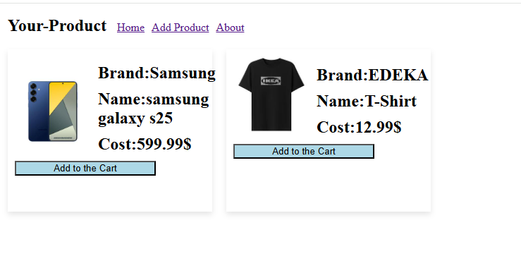

# 🛒 E-Commerce App

This is a simple e-commerce management app that allows adding, editing, and deleting products.  
The project is currently still under development.

---

## ✨ Features (so far)

- ✅ Add products  
- ✅ Edit products  
- ✅ Delete products  
- ⏳ More features like cart, user management, login & checkout coming soon

---

## 📸 Screenshots

### Product Overview  


### Add / Edit Product  


---

## ⚙️ Installation & Start

1. Install the project:

```bash
npm install
```

2. Start the project:

```bash
npm run dev
```

3. Open in your browser:  
   http://localhost:5173

---
