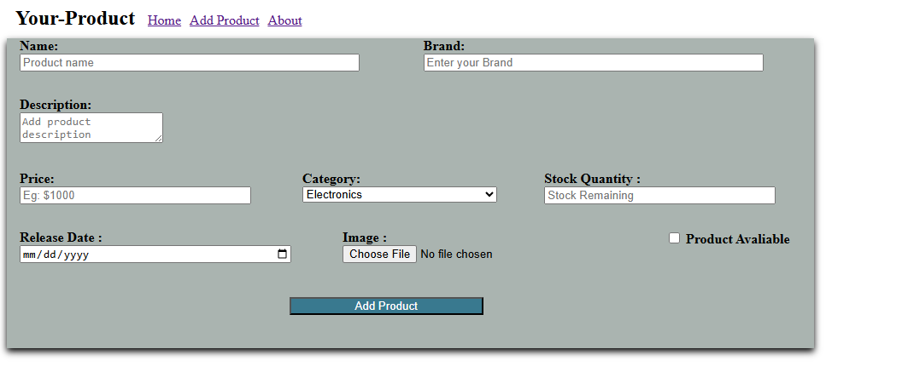

# 🛒 E-Commerce App

Dies ist eine einfache E-Commerce-Verwaltungs-App, die es ermöglicht, Produkte hinzuzufügen, zu bearbeiten und zu löschen.  
Das Projekt befindet sich derzeit noch in der Entwicklung.

---

## ✨ Features (bisher)

- ✅ Produkte hinzufügen
- ✅ Produkte bearbeiten
- ✅ Produkte löschen
- ⏳ Weitere Funktionen wie Warenkorb, Benutzerverwaltung, Login & Checkout folgen

---

## 📸 Screenshots

### Produktübersicht


### Produkt hinzufügen / bearbeiten


> 💡 Speichere deine Screenshots im Projektordner unter z. B. `screenshots/` und passe die Pfade ggf. an.

---

## ⚙️ Installation & Start

1. Projekt installieren:

```bash
   npm install
   ```
2. Projekt starten:
 ```bash
   npm run dev
   ```
3. Öffne im Browser:
   http://localhost:5173
